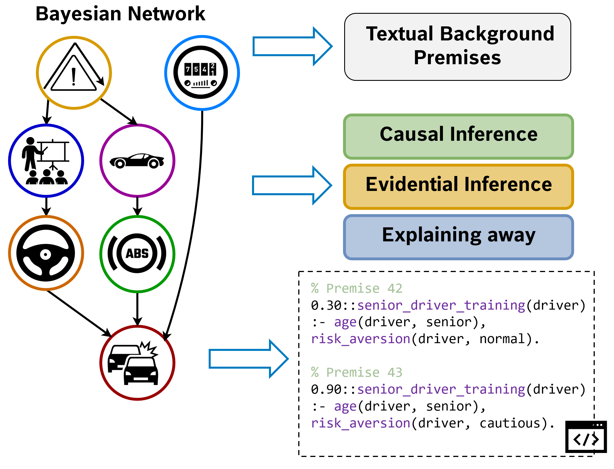

<!---

    Copyright (c) 2024 Robert Bosch GmbH and its subsidiaries.

-->

# QUITE - Experiment Resources

This repository contains the companion material for the following publication:

> Timo Pierre Schrader, Lukas Lange, Simon Razniewski, Annemarie Friedrich. **QUITE: Quantifying Uncertainty in Natural Language Text in Bayesian Reasoning Scenarios** EMNLP 2024.

Please cite this paper if using the dataset or the code, and direct any questions regarding the dataset or code to
`timo [DOT] schrader [AT] de [DOT] bosch [DOT] com`.

<p align="center">

</p>

## Purpose of this Software

This software is a research prototype, solely developed for and published as
part of the publication cited above.
It will neither be maintained nor monitored in any way.

## The QUITE Benchmark

QUITE (**Q**uantifying **U**ncertainty **i**n natural language **Te**xt) is an entirely new benchmark that allows for assessing the capabilities of neural language model-based systems w.r.t. to Bayesian reasoning on a large set of input text that describes probabilistic relationships in natural language text.

For example, take the following statement from QUITE:

> _If Plcg is in a high state, PIP3 appears in a low state in 42% of all cases, in an average state in 44% of all cases and in a high state in 14% of all cases._

This statement about protein signalling pathways refers to the following (Bayesian-style) probabilities:

$\mathbb{P}(PIP3 = low | Plcg = high) = 0.42$

$\mathbb{P}(PIP3 = average | Plcg = high) = 0.44$

$\mathbb{P}(PIP3 = high | Plcg = high) = 0.14$

### Reasoning Types

Many of the QE pairs in QUITE are associated with a specific kind of _reasoning type_.
Consider a Bayesian network with three nodes and two edges: $V_1 \rightarrow V_3 \leftarrow V_2$.
There are the following three reasoning types available in QUITE:
* __causal__: In the case of the three-node network, this would correspond to observing $V_1$ and reasoning about the probability of $V_2$.
* __evidential__: This is the other way around, where we observe the effect $V_2$ and reason about the cause $V_1$.
* __explaining away__: Explaining away refers to observing one cause ($V_1$) and the potential effect ($V_2$) s.t. that the first cause "explains away" the need for the second cause ($V_3$).

For more information and statistics of QUITE, please refer to our paper.

**Note**: We provide multiple thousand additional evidence-query pairs that were **not** used in any part of the paper (i.e., neither training nor evaluation).
Feel free to do whatever you'd like to do with them!
We declare these additional QE pairs as _silver standard_ data.

## Data Format

We provide our dataset in the form of a Hugging Face dataset.
Therefore, it can be easily loaded locally using the following code snippet:

```Python
from datasets import Dataset, load_dataset, Split
from src.constants import QUITE_PATH, QUITE_DATA_PATH, QUITE_Config
train_dataset: Dataset = load_dataset(
        path=QUITE_PATH,
        data_dir=QUITE_DATA_PATH,
        name=QUITE_Config.NUMERIC.value,
        ignore_verifications=True,
    )
```
You can lookup the definitions of the different symbolic constants in [constants.py](src/constants.py).
The data files themselves are located in [data/quite-corpus/](data/quite-corpus/).

Alternatively, you can also use the version provided on the Hugging Face hub.

### Configs

There are four configs that can be passed to the positional argument `name=` of the `load_dataset()` method:

* `numeric-premises`: These are the probabilistic premises that describe probability distributions using numeric values
* `wep-based-premises`: These are the probabilistic premises that describe probability distributions using _words of estimative probability_ (WEP)
* `evidence-query-pairs`: These are pairs of evidences and queries that define observations and ask for a specific probability given evidences and probabilistic premises
* `additional-evidence-query-pairs`: As described above, these are thousands of additional QE pairs that were **not** used in the paper, but we still provide them since we created them anyways.

We created an `Enum` called `QUITE_Config` in [constants.py](src/constants.py) that can also be used to load one of the four configs. Make sure to use `QUITE_Config.<CONFIG_NAME>.value`, i.e., we need to use the underlying string obtained by `.value`!

### Data Fields

The `numeric-premises` and `wep-based-premises` configs contain the following data fields:
* `id`: Unique instance ID
* `story_id`: Story ID for instances that belong to the same network and QE instance
* `input`: Input probability premise
* `target`: Target Problog representation
* `history`: Input premises and target representations that occur prior to this instance and belong to the same story
* `split`: Either `train`, `validation`, or `test`
* `network_name`: Name of the Bayesian network
* `file_name`: Name of the data file

The `evidence-query-pairs` and `additional-evidence-query-pairs` configs contain the following data fields:
* `id`: Unique instance ID
* `story_id`: Story ID for instances that belong to the same network and QE instance
* `qe_id`: Input probability premise
* `input`: Input evidence or query statement
* `target`: Target Problog representation
* `history`: Input premises and target representations that occur prior to this instance and belong to the same story
* `answer`: The numeric probability that of the QE pair given the probabilistic model
* `split`: Either `train`, `validation`, or `test`
* `network_name`: Name of the Bayesian network
* `file_name`: Name of the data file

### Split Setup

Our dataset is divided into three splits (`train`, `validation`, `test`), please look them up in the paper for further explanation.

## Setup

Setup the Python virtual environment using conda by executing `conda env create -f environment.yml`. Additionally, to be able to use [flash attention](https://github.com/Dao-AILab/flash-attention), please execute the following command **after** having created and activated the conda environment: `pip install flash-attn==2.5.8 --no-build-isolation`

You might additionally add the root folder of this project to the `$PYTHONPATH` environment variable. This enables all scripts to automatically find the imports.

**IMPORTANT:** If you created your Python environment using our [environment.yml](environment.yml), it is likely that you will run into the following error when starting an sglang server with Mixtral: `TypeError: ReplicatedLinear.__init__() got an unexpected keyword argument 'linear_method'`.
To fix this, you need to remove this keyword argument in the constructor call in line 109 of `.conda/envs/quite/lib/python3.10/site-packages/sglang/srt/models/mixtral.py`.

## Code and Experiments

### Experiments

We provide code and experiments for multiple fine-tuning and prompt-based approaches.
Runner scripts are available in [scripts/](scripts/) which should work out of the box.
The scripts add the path of the root folder of this repo to the `$PYTHONPATH` env variable.
If that somehow fails, please manually add this repo to your `$PYTHONPATH`.

The static baselines as reported in the paper can be calculated in [src/experiments/static_baselines/predict_static_probs.ipynb](src/experiments/static_baselines/predict_static_probs.ipynb)

### Reproducibility for Fine-Tuning Approaches

In order to reproduce the numbers of our papers, we provide the list of all hyperparameters. We used Nvidia A100 and H100 GPUs for training and evaluation. Please note that different GPUs might produce slightly different numbers due to differences in floating-point arithmetic. For further configurations, please refer to our paper. If you need help or have any questions regarding the experiments, feel free to contact us! Also, if you find better configurations, you are invited to let us know!

|               | Problog     | Textual Prediction | Regression |
| ------------- | ----------- | ------------------ | ---------- |
| Learning Rate | $5e-5$      | $5e-5$             | $5e-5$     |
| Batch Size    | $2*1 ; 4*1$ | $4$                | $4$        |
| #GPUs (Zero3) | $2; 4$      | $1$                | $1$        |
| LoRA Rank     | $64$        | $64$               | $64$       |
| LoRA $\alpha$ | $32$        | $32$               | $32$       |

**Note: The Problog training is really, really unstable. Even when using the exact same parameters as we did, you might end up with a non-working model. However, after at most a few training runs, you should get at least one pretty well working model.**

### Large Language Models
Besides the API-based GPT models, we use the following open-weight LLMs in our experiments:

* [meta-llama/Meta-Llama-3-8B-Instruct](https://huggingface.co/meta-llama/Meta-Llama-3-8B-Instruct)
* [LlamaForSequenceClassification](https://huggingface.co/docs/transformers/model_doc/llama#transformers.LlamaForSequenceClassification)
* [mistralai/Mistral-7B-Instruct-v0.3](https://huggingface.co/mistralai/Mistral-7B-Instruct-v0.3)
* [mistralai/Mixtral-8x7B-Instruct-v0.1](https://huggingface.co/mistralai/Mixtral-8x7B-Instruct-v0.1)

__IMPORTANT__: It seems that the tokenizers of the Mistral and Mixtral models were changed lately. This leads to Mixtral not working anymore in our experiments. To ensure a working model, please use the tokenizer of the Mixtral revision [1e637f2d7cb0a9d6fb1922f305cb784995190a83](https://huggingface.co/mistralai/Mixtral-8x7B-Instruct-v0.1/commit/1e637f2d7cb0a9d6fb1922f305cb784995190a83).

### Evaluation
The code for evaluating the fine-tuned models as well as for evaluating the out-of-the-box LLMs is located in [src/experiments](src/experiments/).
Every script defines a set of command line arguments that should be provided.
Alternatively, you can also use the runner scripts provided in [scripts/experiments](scripts/experiments/).
Again, if something isn't clear yet, please feel free to ask at any time!

## License

This software is open-sourced under the AGPL-3.0 license. See the
[LICENSE](LICENSE) file for details.
The QUITE dataset is released under the CC BY 4.0 license. See the [LICENSE](data/quite/LICENSE) file for details.
For a list of other open source components included in this project, see the
file [3rd-party-licenses.txt](3rd-party-licenses.txt).

## Citation

If you use our software or dataset in your scientific work, please cite our paper:

```
@misc{schrader2024quitequantifyinguncertaintynatural,
      title={QUITE: Quantifying Uncertainty in Natural Language Text in Bayesian Reasoning Scenarios},
      author={Timo Pierre Schrader and Lukas Lange and Simon Razniewski and Annemarie Friedrich},
      year={2024},
      eprint={2410.10449},
      archivePrefix={arXiv},
      primaryClass={cs.CL},
      url={https://arxiv.org/abs/2410.10449},
}
```
